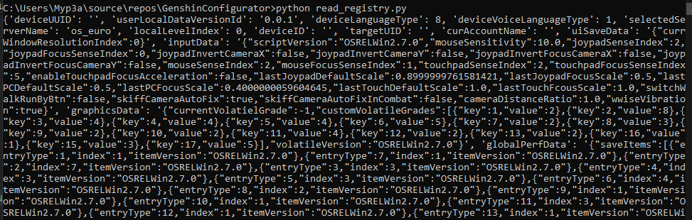
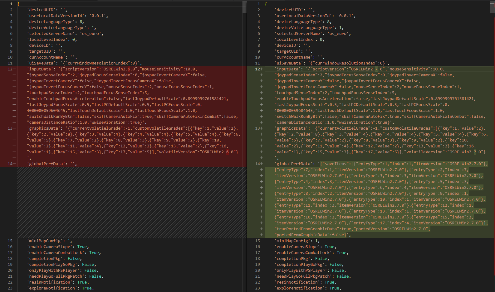

# Genshin Configurator updating guide
A new version of Genshin Impact is released, but the Configurator still isn't updated for it? Here you will find some information to fix it and update to the latest version.

## Guidelines
- Keep the code style. It's fine to mix different ways of writing code, just keep it easily readable.
- Every group of controls should be subclassed, to allow it to be saved and loaded from config file. Do not make direct edits of the main Genshin config, add the functionality into existing class or make a new one.

## What will happen if I run an old version of configurator?
> Newer options will be reset, older ones should work fine

Probably, nothing really bad will happen. Because of the way the game designed, it's fine to have missing lines in the config - they will be initialized to the default values when the game starts. However, this means that if you have changed them - you must change them again, and after a few times it will become frustrating.

## How do I update?
> The update process is illustrated on updating to 2.7

There are two ways of doing it.  
Fast way - newer settings keep their values, no new functions are implemented.  
Full way - all newer settings are implemented.  

Here they are, explained:

---

### Fast way
0. Run the [python script](./read_registry.py) to read old config from the registry. This should be done before opening new version of the game for the first time, to compare the config. If you have already opened it, do not worry - one of the steps just will be a slightly harder.  
  
*Output example*  
1. Update Genshin Impact and run it.
2. Run the [script](./read_registry.py) again.
3. Compare the two configs. If you have opened the game - you can compare newer config to the [wiki config scheme](https://github.com/Myp3a/GenshinConfigurator/wiki/Config-format)  
  
  
*Comparison example*  
4. Modify [JSONSchema.cs](./JSONSchema.cs) to accomodate for new values.  
Here, while the option is changed, it's still a `string` - so no modifications required for this one.  
Also, there are two new `bool` options - they should be added to the JSON schema.  
5. Edit the [wiki](https://github.com/Myp3a/GenshinConfigurator/wiki/Config-format) to reflect the changes to keep it organized and up-to-date to the current config.  

Now, you can bump the version, build the Configurator and use it - all new settings will be at their set values now.  
If you will make this a release - please, mention that this is a "compatibility" version, to make note that it can work a little unexpected in case some options will become tied (exactly as in this update).  

---

### Full way
Do the fast way first. Then, you can continue with this one.  

6. Figure out, what the new values are related to. On this example:
    - Two `bools` probably aren't used much. It's perfectly fine just to add them to the config schema.
    - `globalPerfData` now references `graphicsData`, graphics config - it's the same values, but one value lower.  
    If we change some graphics settings in the game, this one changes too - so, it probably needs to be tied to the graphics data saving - loading shouldn't care about these values.
7. Adjust source code to reflect all the changes. If needed, add UI elements to control new settings.  
Test that:
    - New values are loaded and applied correctly
    - They can be saved and loaded from config files
    - Old config files work fine and retain the value set in the registry

Now you can update the version and make full release - this will be a full version, with support of all new features!