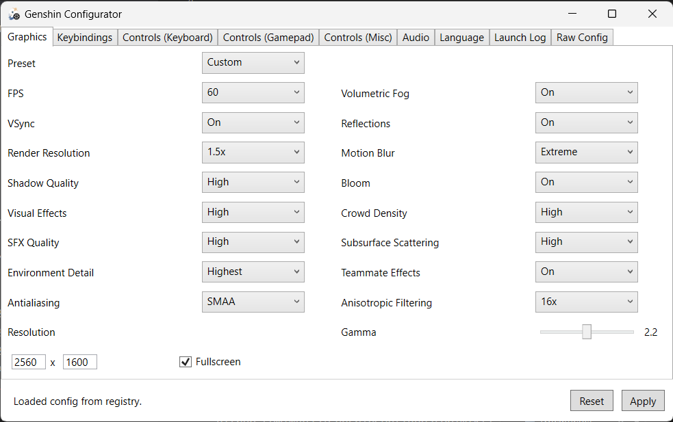


# Genshin Impact Configurator

A configuration tool for Genshin Impact. It allows user to modify game settings outside of it and adds some nifty features.

[Features](#Features) •
[Installation](#installation) •
[Developing](#Developing)

## Features
 - Out-of-the-game graphics settings edit
 - Custom resolution support
 - Save/Load of graphics settings
 - Controls remapping
 - Sensitivity and other control settings
 - Audio settings
 - Language settings
 - Log file viewer
 - Raw config editor

## Installation
Download the [latest release](https://github.com/Myp3a/GenshinConfigurator/releases/latest) and run it!

If you have any questions about app usage, you may consider visiting the [wiki](https://github.com/Myp3a/GenshinConfigurator/wiki).

## Developing

All contributions are welcome!  

You may contribute in several ways like creating new features, fixing bugs or improving documentation and examples.  

If you want to update the Configurator for a new Genshin version, please, read the [updating guide](./CONTRIBUTING.md).  

Currently, there is no code style in this project. Anything is fine while it's easily readable.  

### What's currently missing
 - Add/Remove controls to base list
 - Mouse remapping
 - Controls editor in WPF way
---

> *Disclaimer: Genshin Impact Configurator is an unofficial application and not affiliated with miHoYo or Cognosphere Ltd. in any way. "Genshin Impact" is a registered trademark of Cognosphere Ltd.*
